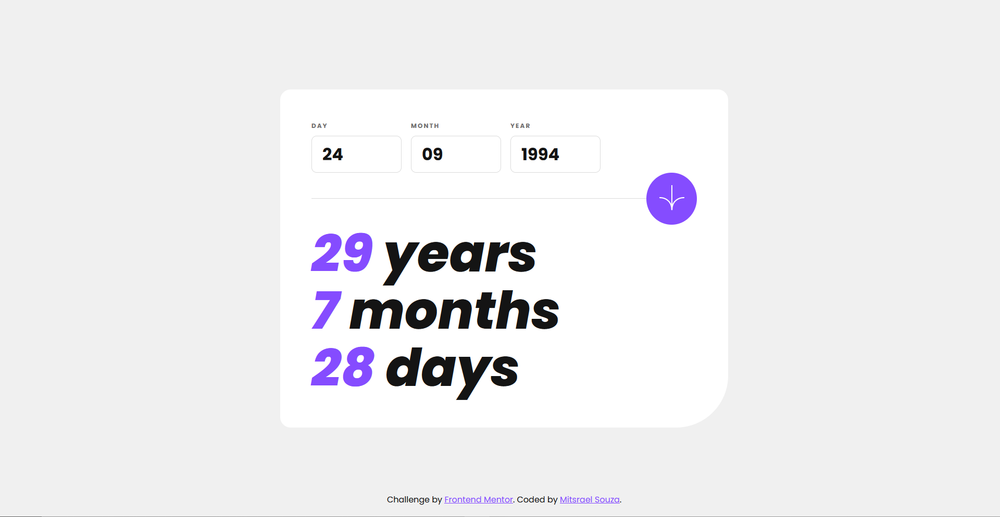
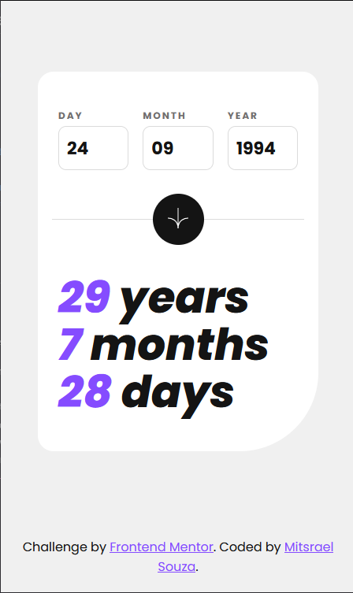

# Frontend Mentor - Age calculator app


# Frontend Mentor - Age calculator app solution

This is a solution to the [Age calculator app challenge on Frontend Mentor](https://www.frontendmentor.io/challenges/age-calculator-app-dF9DFFpj-Q). Frontend Mentor challenges help you improve your coding skills by building realistic projects. 

## Table of contents

- [Overview](#overview)
  - [The challenge](#the-challenge)
  - [Screenshot](#screenshot)
  - [Links](#links)
- [My process](#my-process)
  - [Built with](#built-with)
  - [What I learned](#what-i-learned)
  - [Continued development](#continued-development)
  - [Useful resources](#useful-resources)
- [Author](#author)

## Overview

### The challenge

Users should be able to:

- View an age in years, months, and days after submitting a valid date through the form
- Receive validation errors if:
  - Any field is empty when the form is submitted
  - The day number is not between 1-31
  - The month number is not between 1-12
  - The year is in the future
  - The date is invalid e.g. 31/04/1991 (there are 30 days in April)
- View the optimal layout for the interface depending on their device's screen size
- See hover and focus states for all interactive elements on the page
- **Bonus**: See the age numbers animate to their final number when the form is submitted

### Screenshot

<div align="center">


<br /><br /><br />


<br /><br /><br />

</div>

### Links

-   Solution URL: [GitHub source code](https://github.com/M-its/age-calculator-app)
-   Live Site URL: [Product preview card component page](https://m-its.github.io/age-calculator-app/)

## My process

### Built with

-   Semantic HTML5 markup
-   CSS custom properties
-   Flexbox
-   CSS Grid
-   Mobile-first workflow
-   [SASS](https://sass-lang.com/) - CSS preprocessor
-   Vanilla JavaScript

### What I learned

In this project I praticed validations in inputs and test them in certain conditions, and learned how do manipulate dates and calculate the difference between dates.

```js
switch (this.month) {
        case 2:
            if (
                (this.year % 4 == 0 && this.year % 100 != 0) ||
                this.year % 400 == 0
            ) {
                maxDaysInMonth = 29
            } else {
                maxDaysInMonth = 28
            }
            break
        case 4:
        case 6:
        case 9:
        case 11:
            maxDaysInMonth = 30
            break
        default:
            maxDaysInMonth = 30
    }
```

### Continued development

I neet to learn more about vanilla JavaScript.

### Useful resources

-   [StackOverflow](https://pt.stackoverflow.com/questions/21739/como-validar-data-levando-em-conta-ano-bissexto) - The posts on this section helped me to correctly validate dates.

## Author

-   GitHub - [@M-its](https://github.com/M-its)
-   Frontend Mentor - [@M-its](https://www.frontendmentor.io/profile/M-its)
-   Codepen - [@M-its](https://codepen.io/m-its)
